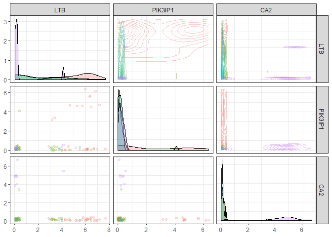

# This is done to emulate the plots from flow cytometry.

but using data from 


```r
#' Gets a data frame from a seurat object
#' 
#' Provided a seurat object, returs a data frame of the count values, being 
#' the columns each 'gene' and the rows each UMI/cell.
#'
#' It returns only the genes annotated as variable and the identity column.
#'
#' @param seurat A seurat object
#'
#' @return
#' @export
#'
#' @examples
#' > as.data.frame.Seurat(pbmc_small)[1:3,1:3]
#'                    LTB EAF2 CD19
#' ATGCCAGAACGACT 6.062788    0    0
#' CATGGCCTGTGCAT 6.714813    0    0
#' GAACCTGATGAACC 7.143118    0    0
#' @importFrom Seurat FetchData GetIdent
as.data.frame.Seurat <- function(seurat) {
    tmp <- Seurat::FetchData(seurat, vars.all = seurat@var.genes) 
    tmp <-  as.data.frame(tmp, stringsAsFactors = FALSE) 
       
    
    tmp$ident <- Seurat::GetIdent(seurat, uniq = FALSE, cells.use = rownames(tmp))
    return(tmp)
}


#' Simulates flow cytometry plotting
#' 
#' Note that it imputes a little bit of noise to values of 0 just for the
#' Sake of visualization
#'
#' @param object data
#' @param markernames 
#'
#' @return a ggplot grid with the plots
#' @export
#'
#' @examples
plot.flowstyle <- function(object, markernames) {
    UseMethod("plot.flowstyle", object)
} 


#' @importFrom GGally ggpairs wrap
plot_flowstyle.data.frame <- function(df, markernames, classif_col = "ident") {
    
    df <- df[,c(markernames, classif_col)] 
    tmp_ident <- df$ident
    
    df[df == 0] <- abs(rnorm(sum(df == 0),mean = 0, sd = 0.2))
    df$ident <- tmp_ident
    

    g <- GGally::ggpairs(
        as.data.frame(df),
        columns = 1:(ncol(df)-1),
        ggplot2::aes_string(colour = "ident"),
        progress = FALSE,
        lower = list(
            continuous = GGally::wrap(
                "dot_no_facet",
                alpha = 0.2)),
        diag = list(
            continuous = GGally::wrap(
                'densityDiag',
                alpha = 0.3)),
        upper = list(
            continuous =  GGally::wrap(
                "density",
                alpha = 0.4))) + 
        ggplot2::theme_bw()
    print(g)
}


plot.flowstyle.seurat <- function(Seurat, markernames, classif_col = "ident") {
    tmp <- as.data.frame.Seurat(Seurat)
    plot_flowstyle.data.frame(tmp, markernames = markernames,
                              classif_col = classif_col)
}
```
 


```r
require(Seurat)
```

# Relies on having done the standard seurat workflow before `FindAllMarkers`


```r
data("pbmc_small")

plot.flowstyle(pbmc_small, c("LTB", "PIK3IP1", "CA2"))
```

```
## Warning in `[<-.factor`(`*tmp*`, thisvar, value = c(0.459051436239938,
## 0.228601367423879, : invalid factor level, NA generated
```

<!-- -->

 
