```r
require(Seurat)
require(dplyr)
require(ranger)
require(partykit)

data("pbmc_small")
```


```r
#' Gets a data frame from a seurat object
#' 
#' Provided a seurat object, returs a data frame of the count values, being 
#' the columns each 'gene' and the rows each UMI/cell.
#'
#' It returns only the genes annotated as variable and the identity column.
#'
#' @param seurat A seurat object
#'
#' @return
#' @export
#'
#' @examples
#' > as.data.frame.Seurat(pbmc_small)[1:3,1:3]
#'                    LTB EAF2 CD19
#' ATGCCAGAACGACT 6.062788    0    0
#' CATGGCCTGTGCAT 6.714813    0    0
#' GAACCTGATGAACC 7.143118    0    0
#' @importFrom Seurat FetchData GetIdent
as.data.frame.Seurat <- function(seurat) {
    tmp <- Seurat::FetchData(seurat, vars.all = seurat@var.genes) 
    tmp <-  as.data.frame(tmp, stringsAsFactors = FALSE) 
       
    
    tmp$ident <- Seurat::GetIdent(seurat, uniq = FALSE, cells.use = rownames(tmp))
    return(tmp)
}


pbmc_df <- as.data.frame.Seurat(pbmc_small)

# Some minor renaming is required for most methods, since some genes have - in 
# their names, and we require R-valid names.

original_names <- colnames(pbmc_df)
newnames <- make.names(original_names)
colnames(pbmc_df) <- newnames
```


## Most Basic Form of Decision Tree based variable selection


```r
tree <- ctree(ident ~ ., pbmc_df)
tree
```

```
## 
## Model formula:
## ident ~ LTB + EAF2 + CD19 + KIAA0125 + CYB561A3 + IGLL5 + PIK3IP1 + 
##     KHDRBS1 + CCR7 + ACSM3 + SRSF7 + S1PR4 + LYAR + SATB1 + IL17RA + 
##     POP7 + ZNF330 + COPS6 + PPBP + PF4 + HIST1H2AC + TALDO1 + 
##     CA2 + ACRBP + TSC22D1 + VDAC3 + GNLY + PTGDR + ARHGDIA + 
##     PCMT1 + S100B
## 
## Fitted party:
## [1] root
## |   [2] PPBP <= 4.75309
## |   |   [3] GNLY <= 4.6764
## |   |   |   [4] LTB <= 3.79076: 1 (n = 28, err = 14.3%)
## |   |   |   [5] LTB > 3.79076: 0 (n = 29, err = 13.8%)
## |   |   [6] GNLY > 4.6764: 2 (n = 13, err = 15.4%)
## |   [7] PPBP > 4.75309: 3 (n = 10, err = 0.0%)
## 
## Number of inner nodes:    3
## Number of terminal nodes: 4
```

```r
varimp(tree)
```

```
##      PPBP      GNLY       LTB 
## 4.4146488 0.9230138 0.6008872
```

```r
plot(tree)
```

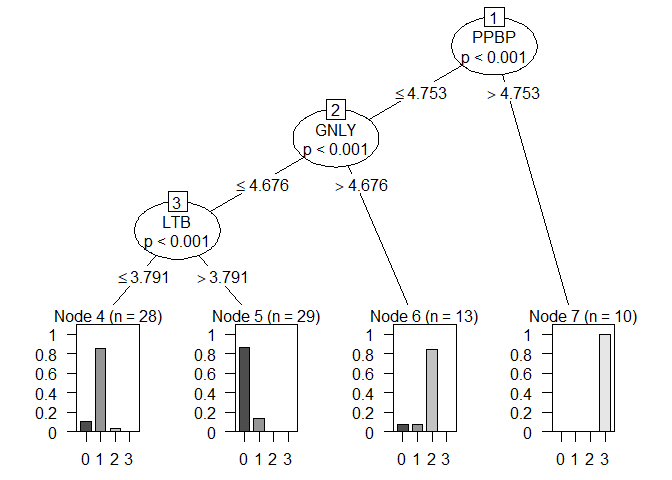<!-- -->

which could be plotted later by selecting the genes that worked best.
Also note how only imprtances are given to the genes that were used in the end.


```r
ggplot2::qplot(x = pbmc_df$PPBP, y = pbmc_df$GNLY, colour = pbmc_df$ident)
```

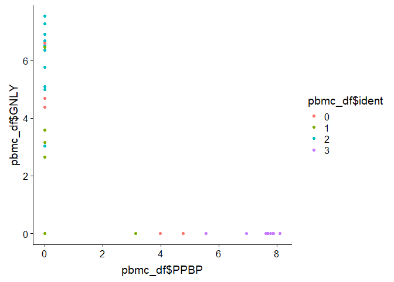<!-- -->

```r
ggplot2::qplot(x = pbmc_df$PPBP, fill = pbmc_df$ident, geom = "density")
```

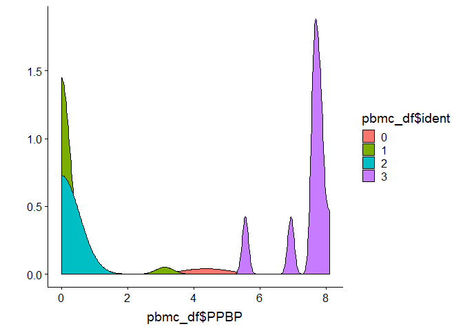<!-- -->

```r
ggplot2::qplot(x = pbmc_df$GNLY, fill = pbmc_df$ident, geom = "density")
```

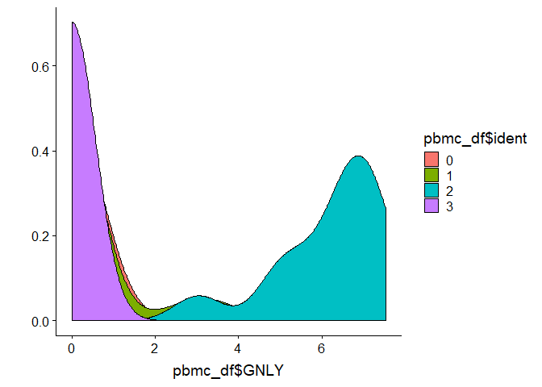<!-- -->


## Most Basic Form of Random forest based variable selection


```r
forest <- ranger::ranger(
  ident ~ ., data =  pbmc_df,
  importance = "impurity_corrected")

forest
```

```
## Ranger result
## 
## Call:
##  ranger::ranger(ident ~ ., data = pbmc_df, importance = "impurity_corrected") 
## 
## Type:                             Classification 
## Number of trees:                  500 
## Sample size:                      80 
## Number of independent variables:  31 
## Mtry:                             5 
## Target node size:                 1 
## Variable importance mode:         impurity_corrected 
## Splitrule:                        gini 
## OOB prediction error:             13.75 %
```

```r
df_importances <- as.data.frame(
  ranger::importance_pvalues(forest)[
      ranger::importance_pvalues(forest)[,'pvalue']<0.05,])
```

```
## Warning in ranger::importance_pvalues(forest): Only few negative importance
## values found, inaccurate p-values. Consider the 'altmann' approach.

## Warning in ranger::importance_pvalues(forest): Only few negative importance
## values found, inaccurate p-values. Consider the 'altmann' approach.
```

```r
head(df_importances[order(df_importances[, "importance"]),] )
```

```
##         importance pvalue
## CCR7     0.2045919      0
## S1PR4    0.3449155      0
## S100B    0.3828387      0
## KHDRBS1  0.4125568      0
## TSC22D1  0.4265032      0
## PCMT1    0.4959871      0
```

```r
dim(df_importances)
```

```
## [1] 20  2
```


## Adding_weights for under-represented clusters


```r
# This add weihts to the clusters in proportion to the inverse of their abundance
# TODO find a better way to calculate the weights ...
weights_vars <- ceiling(as.numeric(100/table(pbmc_df$ident)))


forest <- ranger::ranger(
  ident ~ ., data =  pbmc_df,
  importance = "impurity_corrected", 
  class.weights = weights_vars)

forest
```

```
## Ranger result
## 
## Call:
##  ranger::ranger(ident ~ ., data = pbmc_df, importance = "impurity_corrected",      class.weights = weights_vars) 
## 
## Type:                             Classification 
## Number of trees:                  500 
## Sample size:                      80 
## Number of independent variables:  31 
## Mtry:                             5 
## Target node size:                 1 
## Variable importance mode:         impurity_corrected 
## Splitrule:                        gini 
## OOB prediction error:             11.25 %
```

```r
df_importances <- as.data.frame(
  ranger::importance_pvalues(forest)[
      ranger::importance_pvalues(forest)[,'pvalue']<0.05,])
```

```
## Warning in ranger::importance_pvalues(forest): Only few negative importance
## values found, inaccurate p-values. Consider the 'altmann' approach.

## Warning in ranger::importance_pvalues(forest): Only few negative importance
## values found, inaccurate p-values. Consider the 'altmann' approach.
```

```r
head(df_importances[order(df_importances[, "importance"]),] )
```

```
##         importance pvalue
## ACRBP     7.027651      0
## S100B     8.781159      0
## S1PR4    11.097199      0
## PIK3IP1  16.036430      0
## PTGDR    17.903747      0
## TSC22D1  18.037855      0
```

```r
dim(df_importances)
```

```
## [1] 16  2
```

Note that due to the nature of the random forest, it cannot be plotted ...
but importances can


```r
qplot(x = df_importances$importance, y = rownames(df_importances))
```

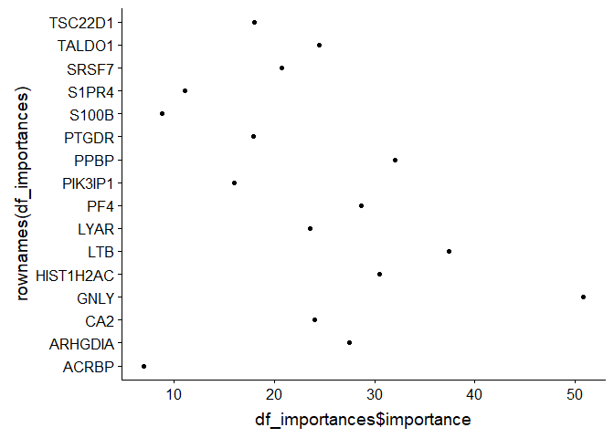<!-- -->

.... since factors are weird in R we need to reorder the levels for the plot to
make sense ...


```r
genes <- forcats::fct_reorder(rownames(df_importances), df_importances$importance)
qplot(x = df_importances$importance, y = genes)
```

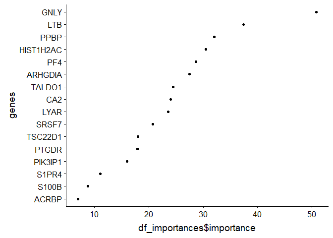<!-- -->


## Packing all in a function


```r
find_cluster_classification_forest <- function(cluster_id,
                                               class_df,
                                               markers, 
                                               report_n = 4) {
    print(paste0("Cluster: ", cluster_id))
    foo2 <- markers %>% 
        unique() %>%
      {class_df[,colnames(class_df) %in% c(., 'ident')]}
    
    in_cluster <- foo2$ident == cluster_id
    out_cluster <- !in_cluster
    
    num_outcluster <- sum(out_cluster)
    num_incluster <- sum(in_cluster)

    foo2$ident <- foo2$ident == cluster_id
    
    # This section alleviates slightly the problem when the cluster is extremely
    # small compared to the non-cluster points.
    # TODO  add a warning whenever this happens...
    if (100 < (num_outcluster/num_incluster)) {
      foo2 <- foo2[c(which(foo2$ident), 
                     sample(which(!foo2$ident), num_incluster*100)), ]
    }
    
    foo2$ident <- factor(make.names(foo2$ident))
        
    forest <- ranger::ranger(
        ident ~ ., 
        data = foo2,
        importance = "impurity_corrected",
        num.trees = 2000)

    df_importances <- as.data.frame(
      ranger::importance_pvalues(forest))
    
    df_importances$marker <- rownames(df_importances)
    
    markers <- dplyr::top_n(df_importances, report_n, importance)$marker  

    return(
      list(markers = markers, 
           tree = forest, 
           cluster = cluster_id, 
           df_importances = df_importances))
}


tmp <- find_cluster_classification_forest(
    cluster_id = "1",
    class_df = pbmc_df,
    markers = pbmc_small@var.genes,
    report_n = 5 )
```

```
## [1] "Cluster: 1"
```

```
## Warning in ranger::importance_pvalues(forest): Only few negative importance
## values found, inaccurate p-values. Consider the 'altmann' approach.
```

```r
lapply(tmp, summary)
```

```
## $markers
##    Length     Class      Mode 
##         5 character character 
## 
## $tree
##                           Length Class         Mode     
## predictions               80     factor        numeric  
## num.trees                  1     -none-        numeric  
## num.independent.variables  1     -none-        numeric  
## mtry                       1     -none-        numeric  
## min.node.size              1     -none-        numeric  
## variable.importance       31     -none-        numeric  
## prediction.error           1     -none-        numeric  
## forest                    10     ranger.forest list     
## confusion.matrix           4     table         numeric  
## splitrule                  1     -none-        character
## treetype                   1     -none-        character
## call                       5     -none-        call     
## importance.mode            1     -none-        character
## num.samples                1     -none-        numeric  
## replace                    1     -none-        logical  
## 
## $cluster
##    Length     Class      Mode 
##         1 character character 
## 
## $df_importances
##    importance           pvalue          marker         
##  Min.   :-0.41368   Min.   :0.0000   Length:31         
##  1st Qu.: 0.04375   1st Qu.:0.0000   Class :character  
##  Median : 0.19959   Median :0.1000   Mode  :character  
##  Mean   : 0.38715   Mean   :0.1935                     
##  3rd Qu.: 0.54979   3rd Qu.:0.1500                     
##  Max.   : 1.95514   Max.   :1.0000
```

## Now applying that function to all the clusters


```r
classif_info <- lapply(unique(pbmc_df$ident), 
       function(x) find_cluster_classification_forest(
         cluster_id = x, 
         class_df = pbmc_df, 
         markers = rownames(df_importances)))
```

```
## [1] "Cluster: 0"
```

```
## Warning in ranger::importance_pvalues(forest): Only few negative importance
## values found, inaccurate p-values. Consider the 'altmann' approach.
```

```
## [1] "Cluster: 1"
```

```
## Warning in ranger::importance_pvalues(forest): Only few negative importance
## values found, inaccurate p-values. Consider the 'altmann' approach.
```

```
## [1] "Cluster: 2"
```

```
## Warning in ranger::importance_pvalues(forest): Only few negative importance
## values found, inaccurate p-values. Consider the 'altmann' approach.
```

```
## [1] "Cluster: 3"
```

```
## Warning in ranger::importance_pvalues(forest): Only few negative importance
## values found, inaccurate p-values. Consider the 'altmann' approach.
```

```r
# This name conversion step carried out by `plyr::mapvalues`
# is required because `FeaturePlot` uses the
# original seurat object which still has the old names
for (i in classif_info) {
   i$markers %>% 
    plyr::mapvalues(
      from = newnames,
      to = original_names, 
      warn_missing = FALSE) %>%
    {
       for (marker in .) {
            FeaturePlot(
                object = pbmc_small,
                marker,
                cols.use = viridis::viridis(7),
                reduction.use = "tsne")
        }
   }
}
```

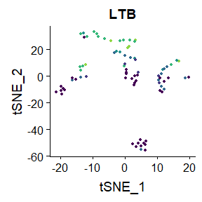<!-- -->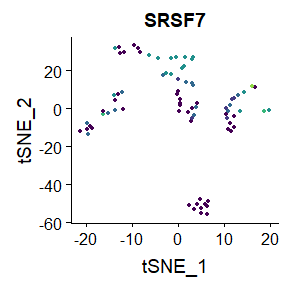<!-- --><!-- -->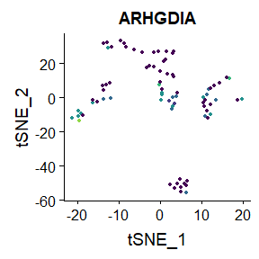<!-- --><!-- -->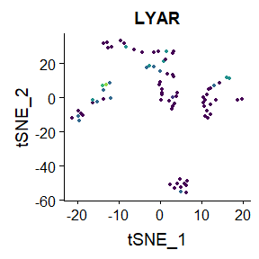<!-- -->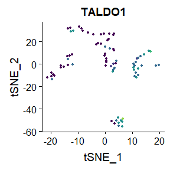<!-- --><!-- -->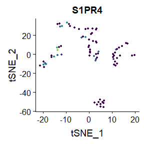<!-- -->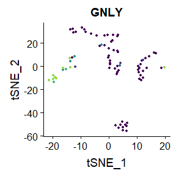<!-- -->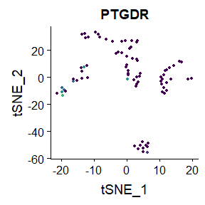<!-- -->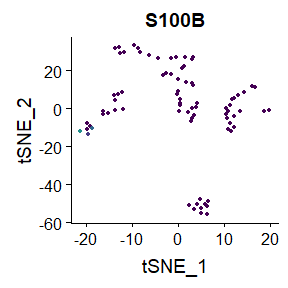<!-- -->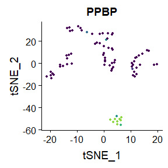<!-- -->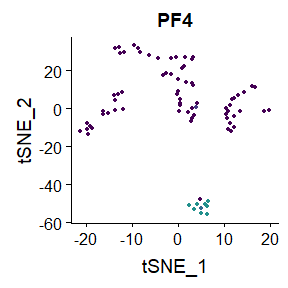<!-- -->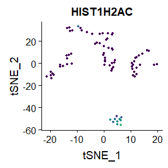<!-- -->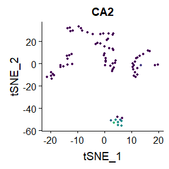<!-- -->


# Adding cross validation ...

Note how this is A LOT more computationlly expensive than running single models


```r
require(caret)
```

```
## Loading required package: caret
```

```
## Loading required package: lattice
```

```r
tc <- caret::trainControl(method = "CV", number = 5)
models <- caret::train(ident ~ ., data = pbmc_df, metod = "ranger", trControl = tc)
models
```

```
## Random Forest 
## 
## 80 samples
## 31 predictors
##  4 classes: '0', '1', '2', '3' 
## 
## No pre-processing
## Resampling: Cross-Validated (5 fold) 
## Summary of sample sizes: 64, 65, 63, 64, 64 
## Resampling results across tuning parameters:
## 
##   mtry  Accuracy   Kappa    
##    2    0.8631373  0.7996033
##   16    0.8239706  0.7492674
##   31    0.8373039  0.7678965
## 
## Accuracy was used to select the optimal model using the largest value.
## The final value used for the model was mtry = 2.
```

```r
varImp(models)
```

```
## rf variable importance
## 
##   only 20 most important variables shown (out of 31)
## 
##           Overall
## LTB       100.000
## GNLY       63.704
## SRSF7      59.118
## TALDO1     53.050
## ARHGDIA    51.556
## HIST1H2AC  44.919
## PPBP       44.283
## LYAR       40.402
## PF4        36.014
## CA2        29.781
## PIK3IP1    24.149
## PCMT1      23.246
## S1PR4      20.039
## COPS6      15.908
## PTGDR      15.052
## KHDRBS1    14.638
## TSC22D1    13.950
## VDAC3      13.772
## ACRBP      12.597
## S100B       8.847
```

```r
require(caret)
tc <- caret::trainControl(method = "CV", number = 5)
models <- caret::train(ident ~ ., method = "glmnet", data = pbmc_df, trControl = tc)
models
```

```
## glmnet 
## 
## 80 samples
## 31 predictors
##  4 classes: '0', '1', '2', '3' 
## 
## No pre-processing
## Resampling: Cross-Validated (5 fold) 
## Summary of sample sizes: 65, 64, 63, 64, 64 
## Resampling results across tuning parameters:
## 
##   alpha  lambda        Accuracy   Kappa    
##   0.10   0.0007270035  0.8864706  0.8372946
##   0.10   0.0072700350  0.9107353  0.8708284
##   0.10   0.0727003496  0.9240686  0.8906909
##   0.55   0.0007270035  0.8622059  0.8014420
##   0.55   0.0072700350  0.8857353  0.8352728
##   0.55   0.0727003496  0.8865686  0.8368542
##   1.00   0.0007270035  0.8497059  0.7855966
##   1.00   0.0072700350  0.8489706  0.7847342
##   1.00   0.0727003496  0.8623039  0.8015515
## 
## Accuracy was used to select the optimal model using the largest value.
## The final values used for the model were alpha = 0.1 and lambda
##  = 0.07270035.
```

```r
varImp(models)
```

```
## glmnet variable importance
## 
##   variables are sorted by maximum importance across the classes
##   only 20 most important variables shown (out of 31)
## 
##                 0      1       2       3
## GNLY      37.0037 30.784 100.000  0.2887
## ZNF330    22.0835 86.581  16.131  0.0000
## IL17RA    30.3852 80.142   0.000  0.0000
## PTGDR      7.2694 34.539  79.819  0.0000
## HIST1H2AC  0.0000 45.180   0.000 79.7686
## ACSM3     78.7536 39.211   0.000  0.0000
## ARHGDIA   78.3957 51.222  33.184  6.0104
## LTB       76.6076 29.458   6.255 11.1912
## LYAR      55.4808 75.210  15.868  0.0000
## TSC22D1    0.0000 34.689   0.000 74.8614
## S100B      0.0000 39.763  65.015  0.0000
## PIK3IP1   64.7260 34.383   0.000  0.0000
## SRSF7     59.3003 20.445   0.000  9.1150
## PPBP       4.4759 27.283   0.000 58.6655
## PCMT1      0.4061 11.322  58.154  2.4732
## TALDO1    53.1823 54.580  14.477 13.0801
## PF4        7.9870  9.510   0.000 52.7984
## CA2        5.6007  8.004   0.000 50.2477
## ACRBP      0.0000 30.323   0.000 49.0650
## S1PR4     24.6467  0.000  47.829  4.6578
```


