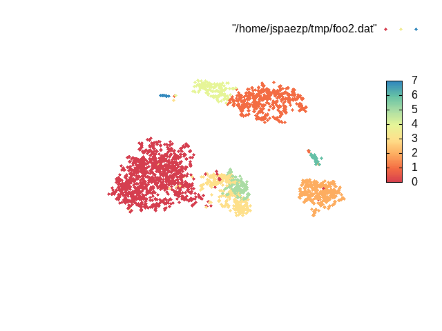

# My little collection of tools to make life nicer with single cell rna seq.

## Current tools

### gp_3dscat.bash

short for ... gnuplot 3d scatterplot
Small bash script that generates a gif from a slightly modified csv file with a last collumn with the color to be used


```{bash}
$ head foo2.dat
#tSNE_1,tSNE_2,tSNE_3,ident
-3.824278,-2.938764,-14.58342,0
25.99714,4.024524,-24.06608,2
-17.09679,-14.56988,-4.378026,0
6.090075,5.095643,28.68763,1
8.743266,-33.059,6.324385,5
-19.86824,-0.0520352,-9.239527,0
0.7465013,-10.59903,-5.955156,3
-0.570028,-18.62549,0.3527747,3
8.9273,-18.918,-2.975641,3
```


```{bash}
$ gp_3dscat.bash foo2.dat
Using foo2.dat as data file
Changing Directory to: /tmp/tmp.EJSEDla4Me
Writting palette file
Simlinking data file
'./foo2.dat' -> '/home/jspaezp/tmp/foo2.dat'
/tmp/tmp.EJSEDla4Me
Plotting
Found 59 PNG Files
Writting final GIF as: /home/jspaezp/tmp/foo2.dat.gif
Cleaning temporary Directory
```




